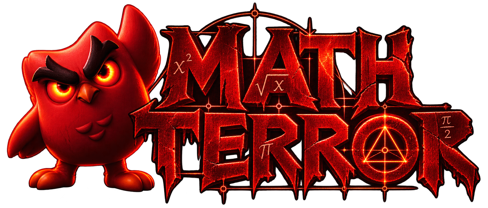

<p align="center">
  
</p>

<h3 align="center">🎮 Aprenda matemática… se tiver coragem.</h3>

<p align="center">
  Projeto acadêmico de <strong>Cálculo 1</strong> — ADS / FATEC (2º semestre)
</p>

---

## 📖 Sobre

**MathTerror** é um jogo educativo web com temática de terror que transforma o estudo de Cálculo 1 em uma experiência imersiva e envolvente. O jogador enfrenta desafios matemáticos sobre **conjuntos**, **funções** e **gráficos** enquanto navega por um corredor sombrio cheio de suspense, jumpscares e efeitos sonoros.

> *"Nas sombras do desconhecido, um guardião desperta. Portas surgirão diante de você. Atrás de algumas, há esperança. Atrás de outras… apenas o vazio e o terror."*

---

## 🕹️ Modos de Jogo

| Modo | Descrição |
|------|-----------|
| **🎬 Modo História** | Narrativa com efeito máquina de escrever e narração por voz. Responda os desafios para abrir as portas e avançar pelo corredor. |
| **💀 Modo Sobrevivência** | Responda o máximo de questões antes de perder suas 3 vidas. Cronômetro de 15 segundos por questão, pontuação progressiva e jumpscares a cada erro. |
| **🏆 Ranking** | Tabela com os 10 melhores resultados salvos localmente no navegador. |

---

## ✨ Funcionalidades

- 🔊 **Áudio imersivo** — música de fundo, efeitos de digitação, narração e som de pulso que acelera conforme o tempo acaba
- 👻 **Jumpscares** — imagens de terror surgem na tela ao errar uma resposta
- 🎥 **Vídeos de recompensa** — ao acertar, uma animação especial é exibida
- ⛶ **Modo tela cheia** — experiência otimizada em fullscreen
- 🔀 **Aleatorização** — perguntas e alternativas embaralhadas a cada partida
- 📱 **Responsivo** — funciona em desktop e dispositivos móveis
- ⌨️ **Atalhos de teclado** — responda com as teclas 1–4

---

## 📂 Estrutura do Projeto

```
MathTerror/
├── index.html              # Página principal
├── style.css               # Estilos e efeitos visuais
├── script.js               # Módulo de entrada (bootstrap)
├── js/
│   ├── config.js           # Configurações gerais (velocidades, tempos)
│   ├── dom-elements.js     # Referências aos elementos do DOM
│   ├── quiz-data.js        # Banco de questões de Cálculo 1
│   ├── quiz.js             # Lógica do quiz (modo história)
│   ├── story.js            # Narrativa com efeito typewriter
│   ├── survival.js         # Modo sobrevivência
│   ├── ranking.js          # Sistema de ranking local
│   ├── scenes.js           # Gerenciamento de cenas
│   ├── audio.js            # Controle de áudio e SFX
│   ├── fullscreen.js       # Toggle de tela cheia
│   ├── game-state.js       # Estado global do jogo
│   └── utils.js            # Funções utilitárias
├── assets/
│   ├── audio/              # Músicas e efeitos sonoros
│   ├── fonts/              # Tipografias temáticas
│   ├── images/             # Logo, horror, imagens do quiz
│   └── videos/             # Vídeos de intro e recompensa
└── README.md
```

---

## 🛠️ Tecnologias

<p>
  
  
  
</p>

- **HTML5** — estrutura semântica e acessível
- **CSS3** — animações, vinheta, ruído visual e layout responsivo
- **JavaScript (ES Modules)** — lógica modularizada sem frameworks

---

## 🚀 Como Executar

1. Clone o repositório:
   ```bash
   git clone https://github.com/walysonfelipe/MathTerror.git
   ```
2. Abra o arquivo `index.html` em um navegador moderno, ou utilize um servidor local:
   ```bash
   # Com Python
   python3 -m http.server 8080

   # Com Node.js
   npx serve .
   ```
3. Acesse `http://localhost:8080` e **entre no corredor do medo** 🚪

> [!TIP]
> Para a melhor experiência, use **fones de ouvido** e ative o **modo tela cheia**.

---

## 📚 Conteúdos de Cálculo 1 Abordados

- Operações com conjuntos (união, interseção, diferença)
- Notação de conjuntos e pertinência
- Funções de 1º grau (afim) e análise de gráficos
- Funções de 2º grau (quadrática) — parábolas, concavidade
- Domínio e imagem de funções
- Composição de funções

---

## 👥 Equipe

Projeto desenvolvido por alunos do curso de **Análise e Desenvolvimento de Sistemas (ADS)** da **FATEC** como atividade avaliativa da disciplina de **Cálculo 1** — 2º semestre.

| | Membro | GitHub |
|---|--------|--------|
| 🩸 | Walyson Felipe | [@walysonfelipe](https://github.com/walysonfelipe) |
| 🩸 | Gabriel Martins | [@orickzs](https://github.com/orickzs) |
| 🩸 | Filipe Rattighieri | [@FilipeRattighieri](https://github.com/FilipeRattighieri) |
| 🩸 | Eduardo Xavier | [@eduduf](https://github.com/eduduf) |
| 🩸 | Gabriel Cardinale | [@Grayved](https://github.com/Grayved) |

---

<p align="center">
  <sub>Feito com 🩸 e matemática.</sub>
</p>
